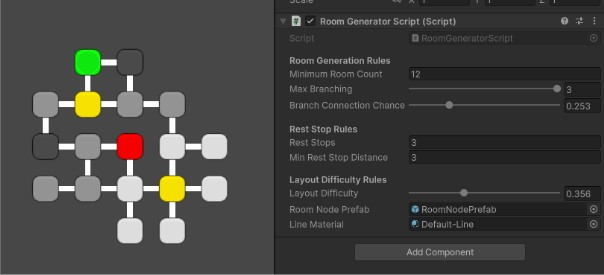

# Dungeon Layout Generator

This generator tool creates room structures in order to create dungeon layouts. These layouts are defined by a starting and ending room, rest stops along the way, and different difficulty levels for every room. Random generation can be easily toggled through multiple options to create layouts that are unique and follow the design that is desired. This generator is designed to be used in unity projects, built to help with development in any dungeon based game, specifically geared towards rouge-like development.

## How to run the Dungeon Layout Generator

This tool is intended to be used in Unity 2D, it will not work any other development environments.

To begin downloading the generator, you can either download the files in this Github, or just copy the C# files provided into your project. 

### If you download the entire Github Repo:

After downloading the repo, open the project from the Unity Hub. After opening it up, you will find a Unity scene with only the main camera. 

To get started within Unity, create an empty game object, and title it: Room Generator. Then, drag the RoomGeneratorScript.cs script under add compenent, and the script should be attached to the Room Generator.

For visual representation, you will want to drag the RoomNodePrefab asset within the assets folder into the respective box on the generator, labeled as Room Node Prefab. Then you can add the Unity preset Default-Line material onto the Line Materials box on the room generator. After doing this, your Room Generator game object should look like this:

PUT IMAGE HERE

After this point, you can change any of the parameters to change what generation will look like, and then you can press the Unity play button, and the generator will create the layout and display it within the scene.

### If you want to put the generator into a current project:

If you don't want to copy the whole project, and simply want to add the scripts into your pre-exisitng project, you only need two C# files.

The only required files for generation are: RoomGeneratorScript.cs, RoomNode.cs, and RoomNodeView.cs.

Once these files are downloaded and added into your current Unity project, create an empty game object, and title it: Room Generator. Then, drag the RoomGeneratorScript.cs script under add compenent, and the script should be attached to the Room Generator.

Then, create a new empty game object, label is as roomNodePrefab. Add the roomNodeView script to that prefab.

For visual representation, you can add whatever textures you want to the open fields, or you can use the Unity defaults. If you want to use the Unity defaults, you will want to drag your RoomNodePrefab asset you created into the respective field in the Room Generator game object. Then you can add the Unity preset Default-Line material onto the Line Materials box on the room generator. After doing this, your Room Generator game object should look like this:

PUT IMAGE HERE

After this point, you can change any of the parameters to change what generation will look like, and then you can press the Unity play button, and the generator will create the layout and display it within the scene. If you don't want the generator to display a visual representation, then you can remove the DrawGraph() function from the RoomGeneratorScript.cs file, and update any implementation that you would like. 

## Generation Parameters

There are 6 main parameters than be adjusted that will meaningfully adjust generation for this generator.

### 1. Main Path Length

This integer will affect how long the minimum path of this generator is. The generator initially generates a singlar line of rooms, called the "spine". The number of rooms in this spine is determined by this parameter, the minimum path length. This parameter will meaningfully adjust the size of the layout that is generated.

### 2. Max Branches Per Room

This integer between 0 and 3 will adjust how many rooms can come off of a single room. Layout is generated on a 2D grid, so each individual room can have 4 possible connections to another room. This variable will set the maxmimum number of branching rooms that a singular room can have. If set the 0, the generator will only generate rooms off of the main spine, but if set to 3, the generator can create up to three rooms off of each room on the spine. The number of branches per room is determined by random chance, but this variable raises the limit of what the range could be. This parameter will adjust how broad and spanning the layout is, with different paths to take.

### 3. Extra Connection Chance

This percentance will determine the chance each room has of connecting to a room next to it. After generating the branches, each room rolls a random value, and based on the extra connection chance, it will generate a connection between the two rooms. Adjusting this parameter will meaninfully adjust the interconnectedness of an individual layout.

### 4. Rest Stop Count

This integer will determine the number of rest stops that are within a layout. In the visual representation, the rest stops are signified by the yellow rooms. These rooms are set apart to be whatever the designer wants, such as a loot room, shop, etc. Adjusting this parameter will meaninfully change how often players will run into rest stops.

### 5. Min Rest Stop Seperation

This integer will determine the minimum distance that each rest stop can be from each other. For example, if it is set to 3, rest stops will need to be at least 3 rooms apart from each other. This can help balance out where rest stops are within the layout, and can help create a more meaningful layout. This parameter will adjust how balanced the rest stops are within an individual layout.

### 6. Difficulty Bias

This percentage will determine the general difficulty bias on a curve for how the layout will be. In the visual representation, easy rooms are light gray, medium rooms are medium grey, and hard rooms are dark grey. Changing this parameter will meaningfully adjust the weighting of difficulty rooms, and how often certain difficulties will appear. For example, a low difficulty bias will create many easy rooms, while a high difficulty bias will create many hard rooms within the layout.

## Example Outputs

INSERT IMAGES

## Known Limitations

The main limitation behind this generator has to do with the spine generation. At times, the generation can curve within itself, and generation will stop before reaching the main path length. This can result in dungeon layouts that are far smaller than requested, and don't fully follow the requested parameters. Furthermore, based on the min rest stop seperation parameter, layouts can be generated with less rest stops than requested. The min rest stop seperation parameter takes precedence over the rest stop count parameter, so at times less rest stops will be generated than wanted. Finally, the last known limitation involves the starting and ending rooms. At time in generation, the starting and ending room can appear somewhat close to each other within the layout, making most of the layout feel obsolete. This is due to the spine based generation, followed by the branching and connection chance parameters, and how the spine based generation works.

## User Feedback

Main user feedback has to do with how interaction with the generator works, and how it behaves. Users struggled with understanding what variables meant, and what they meaninfully did. Later, I renamed that variables to names that better suit what they are representing, and are easier to understand when utilizing the generator. Furthermore, users detected strange generation, especially with the starting and ending rooms. At times, they would generate a "peninsula" with the starting or ending room, which wouldn't make much sense ni an actual dungeon layout. Users also attempted to break the generator by causing parameters to go negative, and having paraters flash with each other logicially. That functionally has since been patched out.

This project was initially designed in UCSC's CMPM 147, instructed by Tyler Coleman
